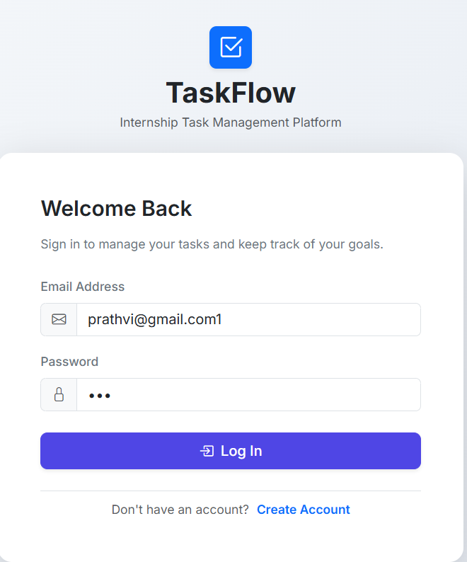
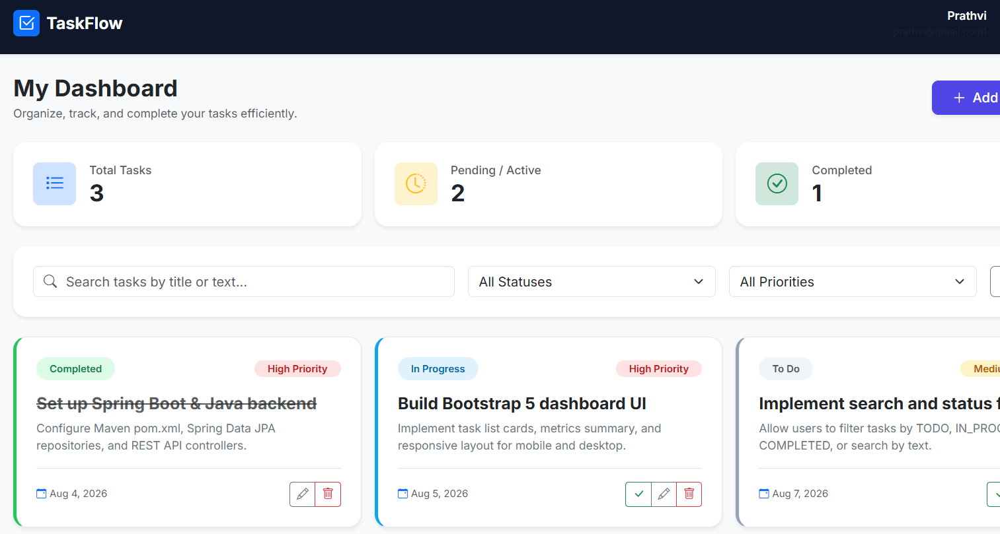

# ✅ TaskFlow — Task Management Application

A clean, responsive **Task Management Web Application** designed to help users create, organize, update, track, and complete their tasks efficiently.

TaskFlow was developed as part of my **internship project**, with the goal of understanding full-stack application structure, CRUD operations, authentication, API integration, dynamic data handling, and responsive web development.

🌐 **Live Demo:**  
https://taskflow-app-smoky.vercel.app/

---

##  Project Preview


---


---

## ✨ Features

### 🔐 User Authentication
- User registration
- User login
- Secure access to the task dashboard
- User-specific task management

### 📋 Task Management
-  Create new tasks
-  View existing tasks
-  Edit task details
-  Delete tasks
- ✅ Mark tasks as completed

###  Task Organization
Each task can contain:

- Task title
- Description
- Status
- Priority
- Due date

### 📊 Dashboard Overview

The dashboard provides a quick summary of:

- Total Tasks
- Pending / Active Tasks
- Completed Tasks

### 🔎 Search & Filtering

Tasks can be easily organized using:

- Task search
- Status filtering
- Priority filtering

###  Responsive Design

TaskFlow is designed to work across:

- 💻 Desktop
- 📱 Mobile
- 📟 Tablet

---

## 🎯 Task Status

Tasks can move through different stages:

```text
TO DO
  ↓
IN PROGRESS
  ↓
COMPLETED
```

This makes it easier to track the progress of individual tasks.

---

##  Priority Management

Tasks can be categorized based on their importance:

- 🔴 High Priority
- 🟡 Medium Priority
- 🟢 Low Priority

---

## 🛠 Tech Stack

### Frontend


### Backend


### Additional Technology


---

##  Application Architecture

TaskFlow follows a structured full-stack architecture:

```text
              USER
                │
                ▼
      ┌───────────────────┐
      │     FRONTEND      │
      │ HTML / CSS / JS   │
      └─────────┬─────────┘
                │
                │ HTTP / REST API
                ▼
      ┌───────────────────┐
      │   SPRING BOOT     │
      │     BACKEND       │
      └─────────┬─────────┘
                │
        ┌───────┴────────┐
        │                │
        ▼                ▼
   Controller        Security
        │
        ▼
     Service
        │
        ▼
    Repository
        │
        ▼
      Database
```

The project separates the frontend, business logic, data access, and security responsibilities to keep the application easier to understand and maintain.

---

## 🔄 CRUD Operations

TaskFlow implements the four fundamental operations used by many web applications:

| Operation | Purpose |
|---|---|
| **Create** | Add a new task |
| **Read** | Retrieve and display tasks |
| **Update** | Modify task information or status |
| **Delete** | Remove an existing task |

---

## 🌐 REST API Structure

The application follows REST-style endpoints for task management.

```http
POST   /api/tasks
GET    /api/tasks
GET    /api/tasks/{id}
PUT    /api/tasks/{id}
DELETE /api/tasks/{id}
```

These endpoints allow the frontend and backend to communicate while keeping application responsibilities separated.

---

## 📂 Project Structure

```text
taskflow/
│
├── backend/
│   ├── controller/
│   ├── service/
│   ├── repository/
│   ├── model/
│   ├── dto/
│   ├── security/
│   ├── exception/
│   └── config/
│
├── frontend/
│   ├── index.html
│   ├── css/
│   └── js/
│
├── assets/
│   └── taskflow-preview.png
│
└── README.md
```

---

##  Running the Project Locally

### 1. Clone the repository

```bash
git clone <your-taskflow-repository-url>
```

### 2. Navigate into the project

```bash
cd taskflow
```

### 3. Start the backend

Navigate to the Spring Boot backend directory and run:

```bash
mvn spring-boot:run
```

Alternatively, run the main Spring Boot application class directly through your IDE.

### 4. Start the frontend

Open the frontend using a local development server or the configured frontend environment.

The frontend can then communicate with the running backend REST API.

---

## 🌍 Deployment

The web application is deployed using **Vercel**.

🔗 **Live Application:**  
https://taskflow-app-smoky.vercel.app/

Deployment helped me understand the difference between running an application locally and making it publicly accessible through a production hosting environment.

---

## 📚 What I Learned

Building TaskFlow helped me move beyond individual programming concepts and understand how different technologies work together inside a complete application.

During this project, I learned and practiced:

- Building a structured full-stack web application
- Creating REST APIs using Spring Boot
- Understanding Controller, Service, and Repository layers
- Implementing CRUD operations
- Connecting frontend logic with backend APIs
- Handling dynamic data using JavaScript
- Working with HTTP requests and responses
- Designing task models and application data
- Implementing user authentication and authorization
- Understanding user-specific data access
- Performing form validation
- Implementing search and filtering
- Creating dashboard statistics from task data
- Designing responsive interfaces using HTML and CSS
- Improving UI/UX for desktop and mobile screens
- Structuring a Maven-based Java project
- Using Git and GitHub for version control
- Debugging frontend and backend integration
- Deploying a web application using Vercel
- Writing cleaner and more maintainable project code

Most importantly, this project helped me understand the overall flow of a full-stack application:

```text
User Action
    ↓
Frontend
    ↓
HTTP Request
    ↓
REST API
    ↓
Business Logic
    ↓
Data Layer
    ↓
Response
    ↓
Dynamic UI Update
```

---

## 🔮 Future Improvements

TaskFlow currently focuses on providing a clean and manageable task management experience.

Possible future improvements include:

- Task reminders and notifications
-  Team collaboration
-  Task assignment between users
-  Real-time updates using WebSockets
-  Advanced productivity analytics
-  Custom task categories/tags
-  Recurring tasks
-  Calendar integration
-  Docker containerization
-  Extended cloud deployment

These features are intentionally kept as future improvements so that the current version remains focused on the core full-stack concepts.

---

##  Internship Project

This application was developed as part of an internship assignment with the objective of building a:

> **Task Management Web Application for creating, updating, and tracking tasks.**

### Assignment Requirements

- ✅ User authentication & authorization
- ✅ CRUD operations for tasks
- ✅ Responsive web/mobile design
- ✅ Dynamic task management
- ⭐ Real-time updates — planned as a future enhancement

The project provided practical experience with full-stack application architecture, API integration, dynamic data handling, and application deployment.

---

## 🤝 Feedback & Contributions

Feedback and suggestions are always welcome.

If you find an issue or have an idea for improving TaskFlow, feel free to open an issue or contribute to the project.

---
## 📝 Contribution Note

> *Note:* GitHub may display *Suryansh Yadav* as a contributor to this repository because I used his laptop during the development of this project. His Git credentials/configuration were already set up on the device and were unintentionally used for some commits and pushes.
>
> The *planning, design, development, implementation, and documentation of TaskFlow were completed by me, Prathvi Chauhan*. The additional contributor attribution is a result of the Git configuration on the device used during development.

---

## 👨‍💻 Author

**Prathvi Chauhan**

B.Tech Computer Science Engineering Student  
Aspiring Java Full-Stack Developer

🌐 Portfolio:  
https://prathvi-portfolio-v1.vercel.app/

💼 LinkedIn:  
https://www.linkedin.com/in/prathvi-chauhan-0b4402392

💻 GitHub:  
https://github.com/prithvinevercodes-ctrl

---

## ⭐ Support

If you found this project useful or interesting, consider giving the repository a **⭐ star**.

It motivates me to continue learning, building, and improving.

---

<p align="center">
  Made with ☕, Java and curiosity by <b>Prathvi Chauhan</b>
</p>
